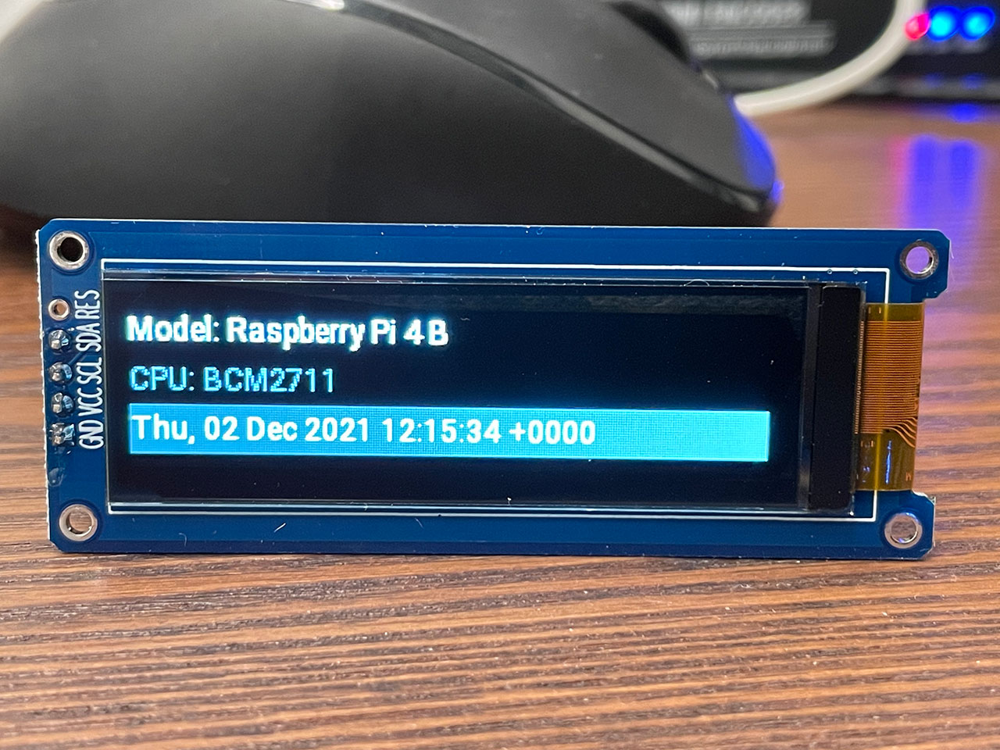

# SH1122 Driver

A user mode driver for SH1122 written in Rust.



## SH1122

SH1122 is a 256x64 16 grayscale OLED/PLED driver with controller.

It is very common to be used in a OLED display module with I2C, SPI, or 8-bit 6800-series or 8080-series interface.

## What's included in this repository

1. `sh1122` is an abstract device driver for SH1122;
2. `sh1122-rppal` uses rppal to drive a SH1122 display with Raspberry PI (note: I2C is the only supported interface yet);
3. `sh1122-clock` is a sample binary using above two crates to display a clock on a SH1122 OLED display.

## Prepare your Raspberry PI

    The code is only tested on a Raspberry PI 4B board, but it should work on other models as well.
    The only exception would be the first generation of Raspberry PI, which uses I2C0 instead of I2C1.

1. Enable I2C and set baudrate to 400k

For modern Raspberry PI firmwares, you should change the `/boot/firmware/usercfg.txt` by adding `dtparam` to enable I2C and make sure it works at fast mode:

```
dtparam=i2c_arm=on,i2c_arm_baudrate=400000
```

Reboot to make this effective.

2. Connect the display to Raspberry PI

    Make sure the Raspberry PI's power is disconnected while connecting the board and the display.

The SH1122 display is powered by 3.3v. Just connect the display's VCC to PI's 3v3, and connect SDL, SCL, GND of the display to those pins with same name on PI.

3. Install packages required by the demo

The demo app uses `freetype-rs` and Roboto font to render text. Some packages should be installed before building this example:

```bash
sudo apt install -y cmake fonts-roboto gcc
```

## Run sample binary

```bash
git clone https://github.com/cnwzhjs/sh1122-rs.git
cd sh1122-rs
cargo run
```

## Get started

To use `sh1122` in your own apps, just add these crates as your dependency:

```toml
[dependencies]
sh1122 = "0.1"
sh1122-rppal = "0.1"
rppal = "0.13"
```

Use the driver in your code:

```rust
use rppal::i2c::I2c;
use sh1122::*;
use sh1122_rppal::*;

// create I2C bus device
let mut i2c = I2c::with_bus(1).unwrap();

// create SH1122 communication interface
let sh1122if = Sh1122I2cInterface::new(
    &mut i2c,
    0x3cu8      // the device address (check the manual of your display module)
).unwrap();

// create SH1122 device
let mut sh1122 = Sh1122Device::with_interface(
    sh1122if,
    256,    // width
    64      // height
);

// initialize display
sh1122.init_display().unwrap();

// fill pixels
for y in 0..sh1122.get_height() {
    for x in 0..sh1122.get_width() {
        sh1122.set_pixel(x, y, x as u8);
    }
}

// transfer framebuffer to display
sh1122.flush().unwrap();
```

## Contributing

:balloon: Thanks for your help improving the project! We are so happy to have you!

## License

Licensed under [MIT license](http://opensource.org/licenses/MIT).
